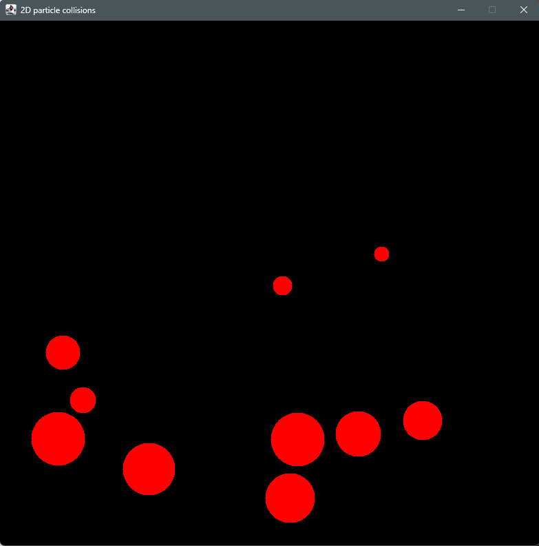

# Particle-collisions

Physics-based program designed to simulate the motion 
of random-sized particles in a two-dimensional space. This project focuses on modeling realistic
physical interactions between particles, such as movement and collisions, by 
utilizing the principles of classical mechanics. The simulation is built in Java 
and is designed to be both efficient and easy to expand, making it suitable for 
educational purposes, prototyping, or further development.



## Table of Contents
1. [Getting Started](#getting-started)
2. [Prerequisites](#prerequisites)
3. [Installation and Usage](#installation-and-usage)
4. [Features](#features)
5. [Technologies Used](#technologies-used)

---

## Getting Started

The `Particle collisions` project is a Java-based physics simulation designed to model particle motion in a 2D space. It incorporates basic physics principles like forces, motion, and collisions.

This guide will walk you through the prerequisites, setup, and usage of the project.

---

### Prerequisites

Before you begin, ensure you have the following installed on your system:

- **Java Development Kit (JDK)** version 8 or higher
- A terminal or command-line tool
- (Optional) **IDE** like IntelliJ IDEA or Eclipse for easier project management

---

### Installation and Usage

1. **Clone the repository**:
   ```bash
   git clone https://github.com/bfilipiuk/Particle-collisions.git
   cd Particle-collisions
   ```
 
2. **Run Jar file by double clicking `Particle-collisions.jar` or via terminal:** 
    ```
   java -jar Particle-collisions.jar
   ```
   
## Features

- Simulates random-sized particles motion and collisions in a 2D space.
- Code configurable simulation parameters.

## Technologies used
- **Programming Language:** Java
- **Development Environment:** IntelliJ IDEA
- **Physics Principles:** Classical mechanics for motion and forces


